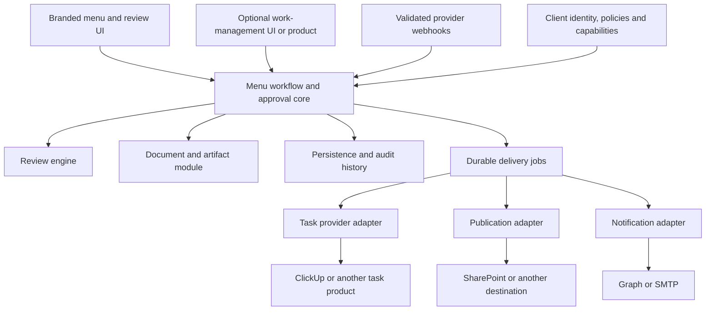

# Architecture review: a reusable client platform

Date: 2026-09-07. Status: recommendation, not a refactor implementation.

The approved work is specified in [Client platform implementation specification](design-docs/client-platform-implementation-spec.md), including exact boundaries, migration/activation behavior, route permissions, protected learning code and required verification. Implementation is delegated separately; this review does not claim those changes are built.

Reviewed the current checkout, including the uncommitted learning/design work. The completed quality/performance branch was fast-forwarded into `main` at `8320f250` at the user's request. Five overlapping setup/documentation files were reconciled without losing either change; 105 unrelated modified tracked files were byte-checked unchanged, and eight focused suites passed with 111 tests. Existing untracked implementation files were left in place. No shared service restart or deployment was performed.

## Recommendation

Keep one product codebase and versioned releases, initially with a separate deployment, database, file storage and secrets for each client. Each client selects branding, workflow policy and integrations through validated configuration. Client-specific code belongs in a bounded adapter or optional product module, rather than a fork of Menu Manager.

The current system has useful reusable pieces: tenant configuration, internal authentication, the LLM adapter, diff helpers, document-processing scripts, and workflow functions with injected dependencies. The central weakness is **ownership**: an integration service owns business operations that every client needs. Having separate service processes does not make these responsibilities independently replaceable.

The acceptance criterion is concrete: a new client can submit, review, approve and download a menu without ClickUp running; adding a task provider changes configuration and an adapter, while those core operations remain unchanged.

## Highest-value boundaries

| Priority | Current evidence | Recommended ownership |
| --- | --- | --- |
| 1. Approval core | Browser approval always calls the ClickUp service; its finalizer persists approved state and artifacts, publishes to SharePoint and triggers downstream work. Quick approval/upload follow another path. | A shared menu-workflow module owns approval decisions, revision checks, current-menu changes, approved artifact records and audit history. Browser, webhook and future task app invoke the same commands. |
| 2. Independent integrations | Submission constructs ClickUp payloads and handles its delivery details. SharePoint uploads and downloads also run through the ClickUp service. | Separate task-management, artifact-publication and notification contracts. A client can choose each independently. Provider payloads, credentials, status names and retry interpretation stay in adapters. |
| 3. Explicit client setup | The loader merges incomplete/malformed configuration over RSH defaults, including emails. Runtime rulebook and property-routing defaults can outlive a client-config change. | Versioned, validated client configuration with explicit initialization. Missing required production identity/settings must fail clearly; generic development defaults may remain. Client rules, template files and destination mappings are client-owned. |
| 4. Reliable workflow state | External task creation precedes saving its ID; webhook acknowledgment precedes durable processing. Approval has timeout recovery to distinguish a saved decision from failed follow-up. | Persist approval and outbound delivery intent together; process delivery in a worker. Deduplicate inbound events and support retries/reconciliation. Keep approval status separate from delivery status. |
| 5. Data and artifact ownership | Dashboard uses both direct Supabase access and the DB service. Finalization passes local paths between services on a shared disk. | One owner for core writes and transactions, with typed operations. Documents have stable artifact IDs and version/provenance metadata. Providers receive streams or authenticated artifact retrieval, not another server's filesystem path. |
| 6. Product identity and permissions | Application routes rely on service authentication without a general end-user permission layer. Separate deployments isolate clients but do not distinguish chefs, reviewers and managers inside a client. | Authenticated staff identity, role/property permissions and audited commands. Keep any anonymous submission flow explicitly scoped. A richer task board depends on this foundation. |

### Evidence in current source

- Mandatory provider finalization call: [approval-workflow.ts](../services/dashboard/lib/approval-workflow.ts), `submitBrowserApproval`, around line 279. Separate quick/upload persistence is around line 85.
- Provider service owns approval persistence and effects: [clickup-integration/index.ts](../services/clickup-integration/index.ts), `finalizeApprovedSubmission`, around line 1397.
- ClickUp-specific submission delivery: [submission-workflow.ts](../services/dashboard/lib/submission-workflow.ts), around lines 620–750.
- Design handoff requires a ClickUp attachment and configured status: [clickup-integration/index.ts](../services/clickup-integration/index.ts), around lines 2130–2168.
- SharePoint download through the task service: [dashboard/index.ts](../services/dashboard/index.ts), around line 622. SharePoint upload implementation is in [clickup-integration/index.ts](../services/clickup-integration/index.ts), around line 1234.
- Default tenant identity/emails and permissive fallback: [tenant-config/src/index.ts](../services/tenant-config/src/index.ts), around lines 169–204 and 303–316. Hardcoded property routing: [db/index.ts](../services/db/index.ts), around lines 109 and 353.
- Direct database access in a UI-owned module: [approved-menus.ts](../services/dashboard/lib/approved-menus.ts), line 3.
- Staff-facing draft listing and approval routes: [dashboard/index.ts](../services/dashboard/index.ts), around lines 3161 and 1999. The service-role database client is [supabase-client/src/client.ts](../services/supabase-client/src/client.ts). External proxy protection was not assessed; these are application-code findings.
- Fixed dependency on the ClickUp container: [docker-compose.yml](../docker-compose.yml), dashboard dependencies. Existing per-business deployment model: [white-label configuration](design-docs/white-label-config.md).

One documentation discrepancy matters: `docs/architecture.md` describes task creation as fire-and-forget, but the current submission code awaits it. This review treats current source as authoritative.

## What “no ClickUp” means today

| Operation | Current behavior without ClickUp credentials |
| --- | --- |
| Submit menu | Submission persists; task creation skips and the UI presents an integration warning. |
| Internal review queue | Available from database state. |
| Browser approval | Can finalize without a task/token, but still needs the ClickUp integration service running. |
| Design approval | Review and PDF persist, but handoff remains blocked without the linked task/next status. |
| SharePoint | Can operate without ClickUp credentials, but its implementation still lives in that service. |

Introduce an explicit disabled task-integration mode. Disabled is an intentional product configuration, not an error; enabled-but-misconfigured must be diagnosed separately. Successful menu approval must not require an external task status update. If a client requires confirmed publication before an artifact is considered distributed, represent that as a separate policy and delivery state.

## Target structure

These are module boundaries first. They can initially run in the existing web process and background workers; each does not need a new HTTP service.

- **Menu workflow:** owns menus, revisions, submissions, approval stages/decisions and canonical state. Start with a few commands such as submit, record approval, reject and approve design. The domain model does not need ClickUp field names or Express request objects.
- **Review engine:** owns the existing guarded review behavior and its defined inputs/results. Preserve the active learning/evaluation contracts. Moving code to a reusable package can follow the current evaluation; changing algorithms is separate work.
- **Documents:** owns extraction, rendering, generation and immutable artifacts. Keep Python subprocess isolation where useful. Distinguish the canonical file store from optional publication copies in client systems.
- **Persistence:** provides explicit operations and transaction boundaries for the workflows being moved. Choose one owner for mutations; avoid keeping duplicate HTTP and direct-Supabase write paths for the same operation. A database-backed delivery table is sufficient initially.
- **Adapters:** implement narrow task, publication or notification capabilities. Do not force unlike integrations into one universal interface. An adapter handles remote IDs/status mappings and does not decide that a menu is approved.
- **Client configuration:** selects identity, templates, workflow policy, enabled capabilities and providers. Keep secrets separate. Keep evolving approved rules in the client's database; upgrades must preserve them.

Replace provider columns incrementally with external references keyed by provider, connection and local entity, allowing multiple integrations without changing the menu model. Track delivery intent, correlation/idempotency key, attempts and outcome. For remote timeouts after uncertain success, reconcile before creating another task; do not promise exactly-once effects from retries alone. Durable inbox records similarly prevent duplicate webhook processing and feedback loops.

## Supporting your own ClickUp-like product

Menu Manager remains authoritative for menu versions and approval decisions. A work-management module/product owns task presentation, assignments, due dates, comments and notifications. Its users invoke the same authorized menu commands used by the existing review UI. A generic “task completed” webhook must never silently become permission to approve a menu.

If the custom product lives inside this application, it can call the shared application module through the same defined operations. If it is independently deployed, give it a versioned API and authenticated events. Do not share its database tables or import its app internals into Menu Manager.

Start with the work features a paying client actually needs. A branded menu-production board with ownership, due dates, discussion and approval links is a bounded addition. A complete general-purpose ClickUp replacement is a separate product scope. Keep optional work-management features out of deployments that only need menu review.

Example product configurations:

| Client | Work tracking | Files/publication | Menu core |
| --- | --- | --- | --- |
| Existing client | ClickUp adapter | Canonical store + SharePoint publication | Shared |
| Client without a task tool | Built-in review queue, external task adapter disabled | Canonical store, optional publication disabled | Shared |
| Client commissioning a board | Optional native work-management module/product | Client-selected publication adapter | Shared |

## Delivery order and acceptance

1. **Define and test the common approval contract.** Characterize browser, quick approval, corrected upload and webhook paths. Decide which differences are intentional. Preserve artifact provenance, revision/concurrency checks and the learning callback contract.
2. **Extract core finalization behind existing routes.** Have the current ClickUp route delegate to it, preserving compatibility. Then route web approval directly through the same application module. Build the standalone path so approval/download work with the ClickUp container absent.
3. **Validate complete client profiles.** Use two fixtures: the existing business and a generic client with no external task integration. Require zero inherited business names, recipients, property destinations or stale rulebook seeds. Define approval stages/policies separately from display labels and remote task statuses.
4. **Separate delivery and harden operational boundaries.** Add durable jobs/inbox, independent task/archive/mail adapters, external references, typed persistence operations and staff authorization. Exercise retry, duplicate webhook, ambiguous timeout and revision-conflict cases.
5. **Implement a real second configuration/provider.** A second client or the first custom board should expose missing abstractions. Add capabilities only when required, rather than inventing a universal plugin framework.
6. **Package releases for repeatable onboarding.** Build one versioned release, inject each client's config/templates/secrets and use separate DB/storage. Version configuration and database migrations, track each client's installed release, and verify backup/restore before upgrades. Use compatible migrations; a code rollback alone cannot undo a destructive schema change.

Acceptance: both representative tenants complete submission → review → approval → artifact download; the standalone client runs with no ClickUp service; enabling/disabling SharePoint is independent of task management; duplicate delivery events do not create duplicate business decisions; roles enforce property/action permissions; upgrades retain the client's approved rules and data.

Shared multi-tenant SaaS can be reconsidered when deployment overhead warrants it. It would require tenant context across queries, files, jobs, identities and authorization, not just swapping the config path or adding a column. Also defer a visual workflow designer, a plugin marketplace, additional microservices and a broker such as Kafka until concrete load or client requirements justify them.

This assessment changes no application behavior beyond the separately authorized audit merge. No architecture refactor or learning/evaluation change has been implemented.
